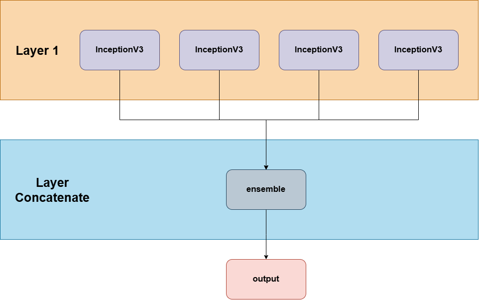

# 1. Information
- Using AI to support doctors in predicting genital disease (9 categories):

    - Balanitis
    - Genital Contact Allergy
    - Genital Psoriasis
    - Genital Warts
    - Lichen Sclerosus
    - Scabies
    - Tinea Cruris
    - Trichomoniasis
    - Vagina Discharge

- Applying skills in image Data processing, Data Augmentation,Transfer Learning, Computer Vision
- Not available for open
- Data consists of 3883 images (Collected from books, Google image and Mycosis Project)
- **Release date:** Apr 2020
- **My role:** AI Intern
- **Language:** Python 3.6
- **Package Enviroment:** [requirements.txt](./requirements.txt)

# 2. AI Development 

## 2.1. Data Preprocessing

- Used Data Augmentation with ImageDataGenerator
- We attempted to generate images from ROI images (Data Augmentation), but the results were not good, and the model could make incorrect predictions. One of the reasons we believe that generating these images by overlaying diseased areas onto other images may lead to critical errors in identifying disease development is the potential for misrepresentation. For instance, certain conditions only manifest on mucosal surfaces, such as the genital or oral mucosa, yet they may be inaccurately placed onto normal skin areas through such editing methods.
- Split data: $70\%$ training, $10\%$ validation, and $20\%$ testing.
- Input size: $373\times373\times3$

## 2.2. Model Development

We utilized the weighted results from the [mycosis](../mycosis/) model that had been trained earlier.

[InceptionV3](https://keras.io/api/applications/inceptionv3/)

The successor to Inception-V1 comprises 24 million parameters. All convolutional layers in Inception-V3 are followed by a batch normalization layer and a ReLU activation. Batch normalization is a technique that standardizes the input for each layer within a minibatch to a normalized distribution $N(0,1)$, accelerating the training process. Inception-V3 effectively addresses the issue of representational bottlenecks, ensuring that the size of layers does not decrease abruptly. Additionally, Inception-V3 achieves greater computational efficiency by employing factorization methods.

- **Inception-A:** An improvement over the Inception V1 module. In the first branch, a $5\times5$ convolutional layer is replaced with two consecutive $3\times3$ convolutional layers, reducing the number of parameters from 25 to 18 while increasing the depth of the model.
- **Inception-B:** An enhancement of Inception-A. In the first and second branches, $3\times3$ convolutions are replaced with $7\times7$ convolutions. Additionally, the $7\times7$ convolution is factorized into two consecutive convolutions: $7\times1$ and $1\times7$, which reduces the number of parameters compared to two consecutive $3\times3$ convolutions. This optimization lowers the parameter count from 18 to 14.
- **Inception-C:** An improvement over Inception-B. The $7\times1$ convolution is replaced with a $3\times1$ convolution, and the $1\times7$ convolution is replaced with a $1\times3$ convolution. Instead of arranging the $3\times1$ and $1\times3$ layers consecutively, they are arranged in parallel. This architecture reduces the number of parameters from 14 to 6.

Additionally, Inception-V3 employs two data dimensionality reduction architectures: **Reduction-A** and **Reduction-B**.

### Ensemble Model

This ensemble model was implemented by combining four re-trained models on the intime dataset (leveraging the weights from the previous mycosis project). A concatenation layer was used to connect these four models, followed by an ensemble layer to assign specific weights to each model. The training was conducted over 200 epochs on the training dataset. The results are reflected in the confusion matrix below.

## 2.3. Confusion matrix

|  | Skin disease  | precision | recall | f1-score | support |
|--| --------------| ---- | ---- | ---- |----|
| | Balanitis  | 0.89 | 0.92 | 0.90 | 62 |
| | Genital_Contact_Allergy  | 0.86 | 0.72 | 0.78 | 25 |
| | Genital_Psoriasis  | 0.87 | 0.89| 0.88 | 62 |
| | Genital_Warts  | 0.92 | 0.94 | 0.93 | 35 |
| | Lichen_Sclerosus  | 0.90 | 0.79 | 0.84 | 34 |
| | Scabies  | 0.91 | 0.91 | 0.91 | 47 |
| | Tinea_Cruris  | 0.91 | 1.00 | 0.95 | 63 |
| | Trichomoniasis  | 1.00| 1.00 | 1.00 | 30 |
| | Vagina_Discharge  | 0.87 | 0.90 | 0.83 | 25 |
| |  |  |  |  |  |
| | accuracy  |  |  |  0.90 | 383 |
| | macro avg  | 0.90 | 0.89 | 0.89 | 383 |
| | weighted avg  | 0.90 | 0.90 | 0.90 | 383 |

# 3. Server Development

We developed a server hosted on a local machine in the lab, accessible through a public IP address. The server features an API that enables partners to conduct testing by uploading images. The AI model processes the uploaded images and returns the prediction results.

The server was built and developed using the Flask framework (ver 1.1).

# Hardware

## For Training:

Computer_1 (4 machines)
- CPU: I7
- Ram: 32GB
- GPU: RTX2070
- SSD: 1TB

Computer_2 (1 machines)

- CPU: I9
- Ram: 64GB
- GPU: RTXTitan x2
- SSD: 1TB
- HDD: 1TB

## Server run on:
- CPU: I7
- Ram: 32GB
- GPU: RTX2070
- SSD: 1TB