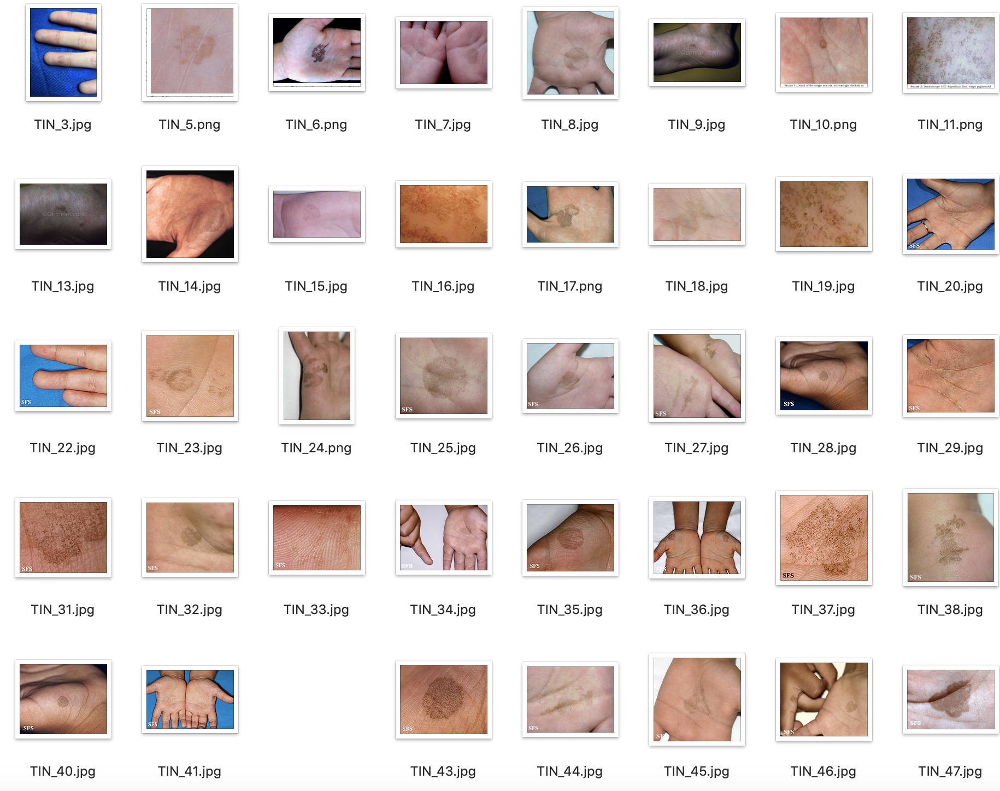
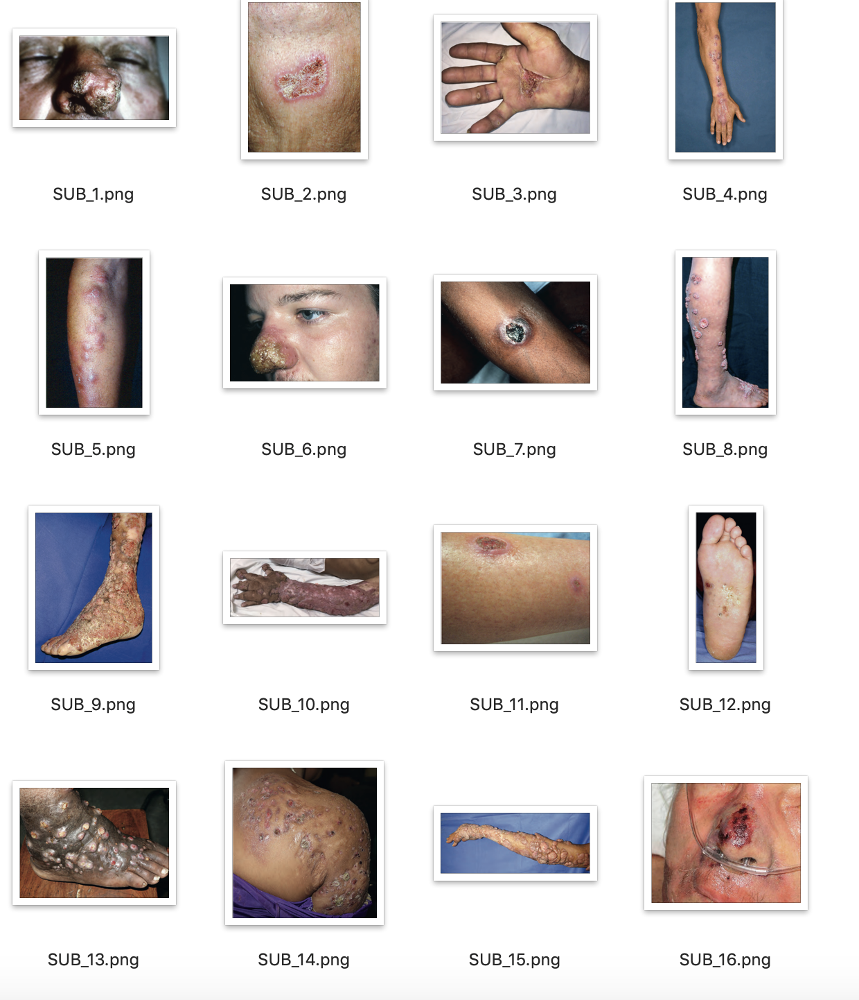

# 1. Information
- Using AI to support doctors in predicting skin fungus (8 categories)
- Applying skills in image data processing and Computer Vision
- Open-source (Available for free)
- Data consists of 9756 images (Collected from books and Google image)
- **Release date:** September 2019
- **My role:** AI Intern
- **Language:** Python 3.6
- **Package Enviroment:** pip install -r requirements.txt

# 2. AI Development 

## 2.1. About data

| Categories | Code | Number of image| Illustration |
|------------|------|:------------:|---------|
| Pityriasis versicolor | PVS | 488 | |
| Folliculitis | PFL | 400 | |
| Seborrhoeic dermatitis and dandruff | SBD | 430 | |
| Tinea nigra | TIN | 257 | |
| White piedra | WPD | 98 | |
| Tinea | TIB, TIP, TIU, TIC | 3318 | |
| Candidiasis |	CAO, CAV, CAB, CAS, CAN | 4321 | |
| Subcutaneous | SUB | 444 | |
| Total |  | 9756 | |

**Data Preprocessing**

- Used Data Augmentation with ImageDataGenerator
- Split data: $70\%$ training, $10\%$ validation, and $20\%$ testing.
- Input size: $150\times150\times3$

## 2.2. Model Development

[Resnet50](https://keras.io/api/applications/resnet/)

[InceptionV3](https://keras.io/api/applications/inceptionv3/)

The successor to Inception-V1 comprises 24 million parameters. All convolutional layers in Inception-V3 are followed by a batch normalization layer and a ReLU activation. Batch normalization is a technique that standardizes the input for each layer within a minibatch to a normalized distribution $N(0,1)$, accelerating the training process. Inception-V3 effectively addresses the issue of representational bottlenecks, ensuring that the size of layers does not decrease abruptly. Additionally, Inception-V3 achieves greater computational efficiency by employing factorization methods.

- **Inception-A:** An improvement over the Inception V1 module. In the first branch, a $5\times5$ convolutional layer is replaced with two consecutive $3\times3$ convolutional layers, reducing the number of parameters from 25 to 18 while increasing the depth of the model.
- **Inception-B:** An enhancement of Inception-A. In the first and second branches, $3\times3$ convolutions are replaced with $7\times7$ convolutions. Additionally, the $7\times7$ convolution is factorized into two consecutive convolutions: $7\times1$ and $1\times7$, which reduces the number of parameters compared to two consecutive $3\times3$ convolutions. This optimization lowers the parameter count from 18 to 14.
- **Inception-C:** An improvement over Inception-B. The $7\times1$ convolution is replaced with a $3\times1$ convolution, and the $1\times7$ convolution is replaced with a $1\times3$ convolution. Instead of arranging the $3\times1$ and $1\times3$ layers consecutively, they are arranged in parallel. This architecture reduces the number of parameters from 14 to 6.

Additionally, Inception-V3 employs two data dimensionality reduction architectures: **Reduction-A** and **Reduction-B**.

## 2.3. Results Training

<html>
<table>
    <tr>
        <th>ID</th>
        <th>Pre-train Model</th>
        <th>Batchsize</th>
        <th>Optimizer Algorithm</th>
        <th>Initial Learning rate 1</th>
        <th>Learning rate decay method 1</th>
        <th>Momentum 1</th>
        <th>Epochs 1</th>
        <th>Last layer</th>
        <th>Initial Learning rate 2</th>
        <th>Learning rate decay method 2</th>
        <th>Momentum 2</th>
        <th>Epochs 2</th>
        <th>Train accuracy</th>
        <th>Validation accuracy</th>
    </tr>
    <tr>
        <td>1</td>
        <td>ResNet50</td>
        <td>30</td>
        <td>RMS</td>
        <td>1E-04</td>
        <td>None</td>
        <td>0.8</td>
        <td>10</td>
        <td>all</td>
        <td></td>
        <td></td>
        <td></td>
        <td></td>
        <td>0.42</td>
        <td>0.22</td>
    </tr>
    <tr>
        <td>2</td>
        <td>InceptionV3</td>
        <td>100</td>
        <td>Stochastic Gradient Descent (SGD)</td>
        <td>5E-04</td>
        <td>None</td>
        <td>0.8</td>
        <td>10</td>
        <td>all</td>
        <td>0.01</td>
        <td>None</td>
        <td>0</td>
        <td>100</td>
        <td>0.62</td>
        <td>0.51</td>
    </tr>
    <tr>
        <td>3</td>
        <td>InceptionResNetV2</td>
        <td>25</td>
        <td>Adam</td>
        <td>1E-05</td>
        <td></td>
        <td></td>
        <td>100</td>
        <td></td>
        <td></td>
        <td>clipnorm</td>
        <td></td>
        <td></td>
        <td>0.804</td>
        <td>0.763</td>
    </tr>
    <tr>
        <td>4</td>
        <td>InceptionResNetV2</td>
        <td>25</td>
        <td>SGD</td>
        <td>0.01/25, 0.001/20, 0.001/20, 0,0001/20</td>
        <td></td>
        <td>0.9</td>
        <td>25</td>
        <td>free 2nd layer</td>
        <td>0.01</td>
        <td>clipnorm</td>
        <td>0.9</td>
        <td>20</td>
        <td>0.796</td>
        <td>0.771</td>
    </tr>
    <tr>
        <td>5</td>
        <td>InceptionV3</td>
        <td>40</td>
        <td>Stochastic Gradient Descent (SGD)</td>
        <td>5E-04</td>
        <td>ReduceLROnPlateau</td>
        <td>0.9</td>
        <td>100</td>
        <td>all</td>
        <td></td>
        <td></td>
        <td></td>
        <td></td>
        <td>0.7949</td>
        <td>0.7281</td>
    </tr>
    <tr style='font-weight:bold;'>
        <td>6</td>
        <td>InceptionResNetV2</td>
        <td>40</td>
        <td>SGD</td>
        <td>0.01</td>
        <td></td>
        <td>0.9</td>
        <td>25</td>
        <td>all</td>
        <td>0.001</td>
        <td></td>
        <td>0.9</td>
        <td>100</td>
        <td>0.9973</td>
        <td>0.9018</td>
    </tr>
    <tr style='font-weight:bold;'>
        <td>7</td>
        <td>InceptionV3</td>
        <td>40</td>
        <td>SGD</td>
        <td>5E-04</td>
        <td>ReduceLROnPlateau</td>
        <td>0.9</td>
        <td>100</td>
        <td>all</td>
        <td>1</td>
        <td>ReduceLROnPlateau</td>
        <td>0.9</td>
        <td>25</td>
        <td>0.963</td>
        <td>0.8804</td>
    </tr>
    <tr style='font-weight:bold;'>
        <td>8</td>
        <td>InceptionV3</td>
        <td>16</td>
        <td>Adam</td>
        <td>1E-5</td>
        <td>Exponential decay</td>
        <td>0</td>
        <td>250</td>
        <td>all</td>
        <td></td>
        <td></td>
        <td></td>
        <td></td>
        <td>0.998</td>
        <td>0.85</td>
    </tr>
    <tr style='font-weight:bold;'>
        <td>9</td>
        <td>InceptionV2</td>
        <td>40</td>
        <td>SGD</td>
        <td>0.01</td>
        <td></td>
        <td>0.9</td>
        <td>25</td>
        <td>all</td>
        <td>0.001</td>
        <td></td>
        <td>0.9</td>
        <td>100</td>
        <td>0.999</td>
        <td>0.894</td>
    </tr>
    <tr style='font-weight:bold;'>
        <td>10</td>
        <td>InceptionV3</td>
        <td>40</td>
        <td>SGD</td>
        <td>5E-03</td>
        <td>ReduceLROnPlateau</td>
        <td>0.9</td>
        <td>100</td>
        <td>all</td>
        <td>1E-3</td>
        <td>ReduceLROnPlateau</td>
        <td>0.9</td>
        <td>100</td>
        <td>0.974</td>
        <td>0.8619</td>
    </tr>
  <caption><b>Summary Results</b></caption>
</table>
</html>

## 2.4. Ensemble Model

After training the model, we performed ensembling on the trained models using a simple voting method. We had the final results, which showed a significant improvement in performance:

**Confusion matrix**

|  | Skin disease  | precision | recall | f1-score | support |
|--| --------------| ---- | ---- | ---- |----|
| | Candidiasis  | 0.94 | 0.96 | 0.95 | 215 |
| | Folliculitis  | 0.86 | 0.85 | 0.86 | 113 |
| | Pityriasis_versicolor  | 0.89 | 0.95| 0.92 | 75 |
| | Seborrhoeic_dermatitis_and_dandruff  | 0.74 | 0.67 | 0.70 | 75 |
| | Subcutaneous  | 0.91 | 0.85 | 0.88 | 62 |
| | Tinea  | 0.90 | 0.91 | 0.90 | 411 |
| | Tinea_nigra  | 1.00 | 0.96 | 0.98 | 45 |
| | White_piedra  | 0.786 | 0.93 | 0.85 | 15 |

# 3. Server Development

We developed a server hosted on a local machine in the lab, accessible through a public IP address. The server features an API that enables partners to conduct testing by uploading images. The AI model processes the uploaded images and returns the prediction results.

The server was built and developed using the Flask framework (ver 1.1).

# Hardware

Server run on:
- CPU: I7
- Ram: 32GB
- GPU: RTX2070
- SSD: 1TB